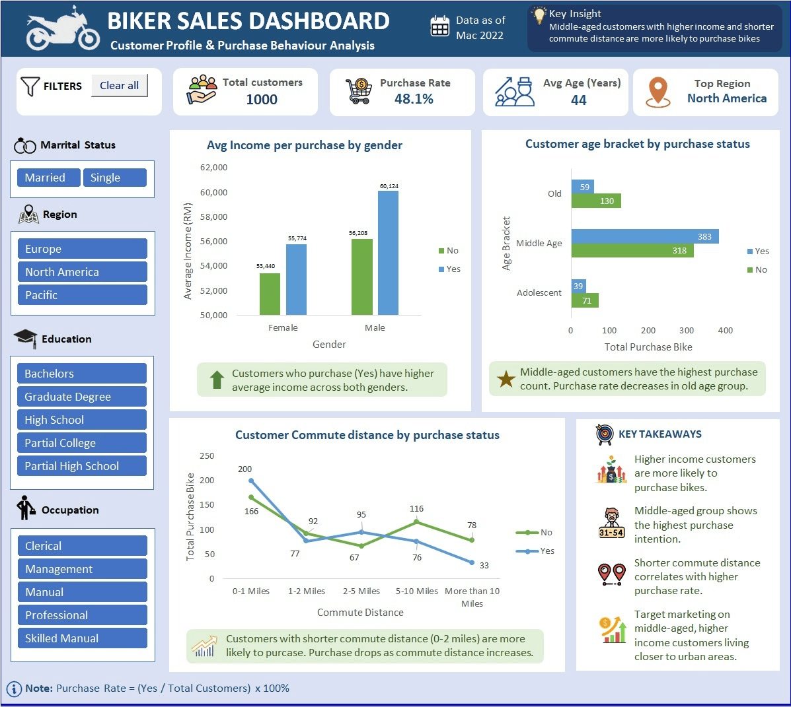

# 🚴‍♂️ Bike Sales Analytics Dashboard
### 📌 Excel | Data Analysis | Customer Segmentation | VBA Automation

---

## 🧠 Overview
This project analyzes customer profile and purchase behaviour for motorbike sales to understand what factors influence bike purchases across different regions, age groups, income levels, and commute distances.

The goal is to identify key customer segments and behavioural patterns that drive higher purchase rates, and provide actionable insights for marketing and sales strategy.

---

## 🎯 Problem Statement
- What type of customers are more likely to purchase bikes?
- How do income, age, and commute distance influence purchase behaviour?
- Which regions and segments should be targeted to increase sales?
- How can marketing strategy be optimized based on customer behaviour?

---

## 🛠️ Tools & Technologies
- Microsoft Excel (Dashboard & Data Visualization)
- Pivot Tables & Excel Formulas
- Data Cleaning & Transformation
- VBA Macros (Automation)
- Data Visualization (Charts, KPI Cards, Slicers)

---

## 📂 Dataset

The dataset used in this project is a simulated bikers customer sales dataset designed for data analysis practice and portfolio development.

### 📊 Dataset Overview
- **Source:** Simulated dataset (educational purpose)
- **Size:** 1,000 customer records
- **Format:** CSV / Excel

### 📌 Notes
This dataset is not real-world data but structured to reflect realistic customer profiles including income, age, occupation, and commute distance.

### Key Columns:
- Age  
- Gender  
- Income  
- Marital Status  
- Education Level  
- Occupation  
- Commute Distance  
- Region  
- Purchase Status (Yes/No)

---

## 🔍 Data Cleaning & Preparation
- Standardized categorical values (Gender, Marital Status)
- Created Age Bracket segmentation (Adolescent, Middle Age, Old)
- Grouped data for KPI calculations
- Built purchase rate (%) metrics
- Prepared pivot tables for dashboard visualization

---

## 🎨 Dashboard Design Theme

### 🌿 Color Palette (Soft & Professional)
- Primary: `#2A9D8F` (Teal)
- Secondary: `#264653` (Deep Navy)
- Accent: `#E76F51` (Soft Coral)
- Support: `#A7C957` (Sage Green)
- Background: `#FAFAF9` (Off White)
- Light Grey: `#E9ECEF`

---

## 📶 Dashboard Preview

  

---

## ✨ Interactive Dashboard File

📁 **Download File:**  
👉 [BIKERS SALES DASHBOARD.xlsm](./BIKERS%20SALES%20DASHBOARD.xlsm)

---

## ⚠️ Important Notice (VBA Macro File)

This project contains **VBA macros (Excel automation code)**.

Please follow the steps below before opening the file:

### 🔓 Step 1: Unblock the file
- Right-click the downloaded Excel file  
- Click **Properties**  
- Tick ✔ **Unblock** (if available)  
- Click **Apply** → OK  

### 📂 Step 2: Enable macros in Excel
- Open the file in Microsoft Excel  
- Click **“Enable Content”** when prompted (yellow security bar)

### 💡 Why this is needed
Windows blocks macros by default for security reasons.  
This is a normal Excel security feature, not an error.

### 👍 Safe to use
This file is used only for:
- Data analysis automation  
- Dashboard updates  
- Reporting tasks  

---

## 📊 Key Insights

- 📈 High-income customers are more likely to purchase bikes  
- 👨‍👩‍👧 Middle-aged group (31–54) shows the highest purchase rate  
- 🚴 Short commute distance (0–2 miles) has the strongest buying behaviour  
- 🌍 North America is the top-performing region  
- 📉 Older age groups show lower purchase probability  
- 👔 Professionals & skilled manual workers are key buyer segments  

---

## 💡 Recommendations

- Focus marketing on middle-aged, high-income customers  
- Target urban areas with short commute distances  
- Promote cycling benefits for daily commuters  
- Re-engage older customer segments with tailored campaigns  
- Expand marketing in high-performing regions  

---

## 🚀 Project Outcome
This dashboard helps businesses identify high-value customer segments and supports data-driven marketing strategies that improve conversion rates and sales performance.

---

## 🎨 Design Principle
This dashboard uses a **soft, modern, low-glare theme** to ensure readability and reduce visual fatigue during analysis sessions.

---

## 📫 Contact

- **Name:** Adibatunnailah binti Abdul Razak  
- **Email:** dibarazak2@gmail.com  
- **LinkedIn:** https://www.linkedin.com/in/adibatunnailah/

---

## ⭐ Note
This project is part of my Data Analyst Portfolio demonstrating skills in Excel dashboarding, data cleaning, visualization, and storytelling.
